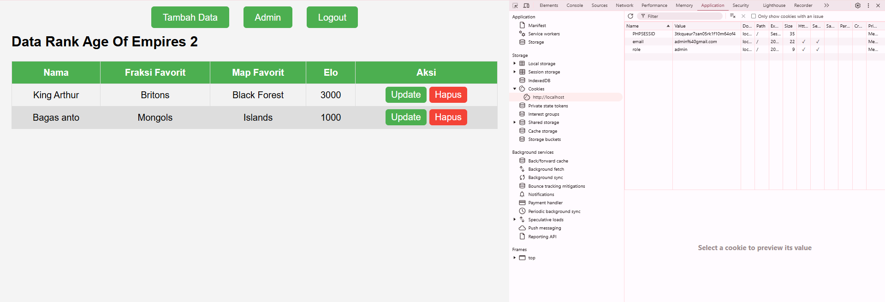

# UAS-Pemrograman-Web

## Bagian 1: Client-side Programming
### 1.1 Manipulasi DOM dengan JavaScript
- Buat form input dengan minimal 4 elemen input

  
  
- Tampilkan data dari server ke dalam sebuah tabel HTML.

  

### 1.2 Event Handling
- Tambahkan minimal 3 event yang berbeda untuk meng-handle form dengan menggunakan javascript yaitu addEventListener 

  

## Bagian 2: Server-side Programming
### 2.1 Pengelolaan Data dengan PHP
- menggunakan metode POST dalam HTTP untuk mengirimkan data ke server, biasanya untuk membuat atau memperbarui sumber daya di server.

  

- melakukan parsing dan melakukan validasi pada sisi server
- menyimpan ke basis data termasuk jenis browser dan alamat IP pengguna.
  - `$browser = $_SERVER['HTTP_USER_AGENT'];` Mendapatkan informasi browser
  - `$ipAddress = $_SERVER['REMOTE_ADDR'];` Mendapatkan alamat IP

  
  

### 2.2 Objek PHP Berbasis OOP
- class Registration
  - `registerUser` : untuk mendaftar akun user.

  
  
- class
  - `Login` : untuk melakukan login akun.
 
  
  
## Bagian 3: Database Management
### 3.1 Pembuatan Tabel Database
- membuat sebuah tabel database dengan nama tabel fraksi yang berfungsi untuk menyimpan data rank aoe2 dan tabel users untuk menyimpan berbagai informasi dari user.
  
  
  

### 3.2 Konfigurasi Koneksi Database
- melakukan konfigurasi koneksi database pada `db.phg` dengan menggunakan host, user, password, dbname.

  

### 3.3 Manipulasi Data pada Database
- melakukan CRUD yaitu menambahkan data, update data, serta menghapus data.

  

## Bagian 4: State Management
### 4.1 State Management dengan Session
- menggunakan `session_start()` untuk memulai session. session digunakan untuk menyimpan informasi tentang pengguna selama mereka berinteraksi dengan aplikasi web.
- `session_start()` digunakan pada saat login dan dihentikan ketika logout.

  
  
- penggunaan session dapat dibagi menjadi 2 role yaitu role admin dan user
- Tampilan admin
  
  
  
- Tampilan user

  

### 4.2 Pengelolaan State dengan Cookie dan Browser Storage
- cookie akan disimpan saat user/admin melakukan login, kemudian akan hilang apabila sudah 1 jam
  
  
  

## Bagian Bonus: Hosting Aplikasi Web
### Apa langkah-langkah yang Anda lakukan untuk meng-host aplikasi web Anda?
1. Persiapkan aplikasi: Pastikan aplikasi sudah siap dan diuji di lingkungan pengembangan.
2. Pilih penyedia hosting: Pilih penyedia sesuai kebutuhan, misalnya AWS untuk aplikasi besar atau DigitalOcean untuk yang lebih kecil.
3. Konfigurasi server: Pilih server Linux/Windows, instal perangkat lunak yang dibutuhkan Apache, Nginx, database.
4. Upload aplikasi: Gunakan FTP atau Git untuk mengunggah aplikasi.
5. Konfigurasi DNS: Arahkan domain ke server hosting.

### Pilih penyedia hosting web yang menurut Anda paling cocok untuk aplikasi web Anda
Hostinger Memiliki paket hosting murah dengan integrasi MySQL dan server yang cepat.

### Bagaimana Anda memastikan keamanan aplikasi web yang Anda host?
1. Menggunakan HTTPS (SSL/TLS).
2. Terapkan firewall dan update perangkat lunak secara rutin.
3. Gunakan autentikasi dan otorisasi yang aman.

### Jelaskan konfigurasi server yang Anda terapkan untuk mendukung aplikasi web Anda
1. PHP: Versi PHP 8.0 atau lebih tinggi.
2. Database: Gunakan MySQL atau MariaDB untuk menyimpan data pengguna.
3. Error Logging: Aktifkan logging untuk mencari error dan debugging.
4. Penerapan caching: Gunakan caching untuk mempercepat kinerja aplikasi.

  

